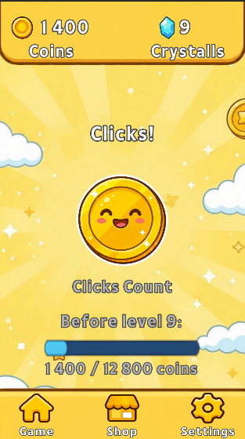
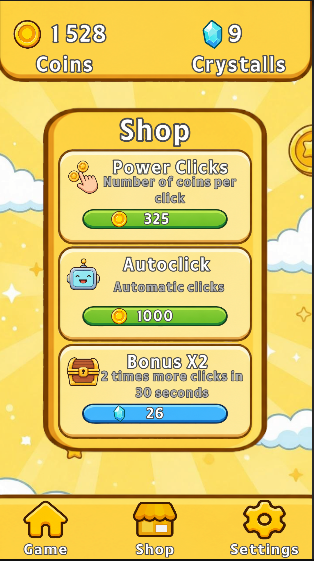

# 🪙 Clicker Game - Unity

<div align="center">
  


Idle Clicker Game with upgrades, levels, and auto-clicker mechanics
</div>

---

## 📖 About

A casual mobile clicker game built in Unity. Tap the coin to earn currency, level up, and purchase upgrades to increase your income. Features an auto-clicker, power-ups, and a shop system.

---

## ✨ Features

| Feature        | Description                              |
|----------------|------------------------------------------|
| 💰 Tapping      | Click the coin to earn coins             |
| ⬆️ Leveling     | Progress through levels with increasing requirements |
| 💎 Crystals     | Earn crystals upon leveling up           |
| 🛒 Shop         | Purchase upgrades (Click Power, Auto Clicker, X2 Bonus) |
| 🤖 Auto Clicker | Earn coins automatically every second    |
| 🚀 Power-ups    | Activate X2 bonus for 30 seconds         |
| 📈 Scaling      | Upgrades cost more as you level up       |

---

## 🛠️ Tech Stack

- Unity 2022+  
- C# 9.0  
- TextMeshPro (UI)  
- PlayerPrefs (Data persistence)  

---

## 🚀 Quick Start

### Installation

```bash
# Clone the repository
git clone https://github.com/yourusername/clicker-game.git
cd clicker-game

# Open in Unity Hub
# Add project and open with Unity 2022 or later
```

---

## 🎮 Gameplay Mechanics

### Currency System

| Currency | How to Earn                        | Uses          |
|----------|------------------------------------|---------------|
| 🪙 Coins  | Tapping, Auto Clicker, X2 Bonus    | Buy upgrades  |
| 💎 Crystals | Level up (20 per level)         | Buy X2 Bonus  |

### Upgrade System

| Upgrade       | Price (Base) | Effect                    |
|---------------|-------------|---------------------------|
| 👆 Click Power | 10 coins     | +1 coin per click         |
| 🤖 Auto Clicker | 200 coins   | +2 coins/sec per level    |
| ⚡ X2 Bonus    | 10 crystals  | 2x earnings for 30 sec    |

### Leveling

| Level   | Requirement                 | Reward        |
|---------|-----------------------------|---------------|
| Level 1 | 100 clicks                  | +20 crystals  |
| Level 2 | 200 clicks                  | +20 crystals  |
| Level 3 | 400 clicks                  | +20 crystals  |
| Level N | 2^(N-1) * 100 clicks        | +20 crystals  |

---

## 📸 Screenshots

<div align="center">
 
 
</div>

---

## 📡 PlayerPrefs Keys

| Key               | Type | Default | Description              |
|-------------------|------|---------|--------------------------|
| Coins             | int  | 0       | Total coins              |
| Crystals          | int  | 25      | Total crystals           |
| Level             | int  | 1       | Current level            |
| ClickPower        | int  | 1       | Coins per tap            |
| AutoClicker       | int  | 0       | Auto clicker level       |
| ClicksForNextLevel| int  | 100     | Required coins to level  |
| X2Uses            | int  | 0       | X2 bonus usage count     |

---

## 🐛 Troubleshooting

| Problem                    | Solution                                      |
|----------------------------|-----------------------------------------------|
| Coins not adding on click  | Check Button OnClick event → call `OnCoinClicked()` |
| Shop buttons not working   | Ensure `ShopManager` is on an active object  |
| Text missing               | Import TextMeshPro Essentials                 |
| Level progress resets      | Set `coins -= clicksForNextLevel` or `coins -= 0` in `CheckLevelUp` |
| Crystals not increasing    | Verify `crystals += 20` in `CheckLevelUp`    |

---

## 🔧 Customization

### Adjust Game Balance

```csharp
// In GameManager.cs
private int baseClickPowerPrice = 10;  // Starting price
private int baseAutoClickerPrice = 200;
private int baseX2BonusPrice = 10;

// Level scaling
clicksForNextLevel *= 2;  // Double requirement each level
```

### Change UI Theme

- Replace sprites in `Assets/Sprites/`  
- Update color in TMP components  
- Adjust font in `Assets/Fonts/`  
